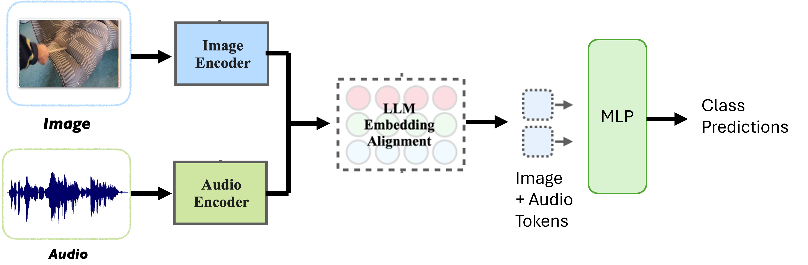

# Multimodal Material Estimation

Implementation of a material estimation model using audio-visual cues using CLIP and Whisper to encode the Image and Audio inputs, and an LLM to align them to a fixed size text embedding space which is later used for Material class prediction. The model description is available at [Report](https://siddharth130500.github.io/images/CSE252D_Final_Project_Report.pdf) 

To run the training code:
`python train.py`
